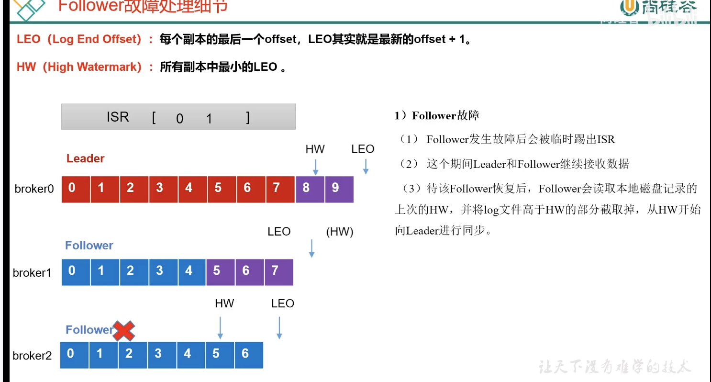
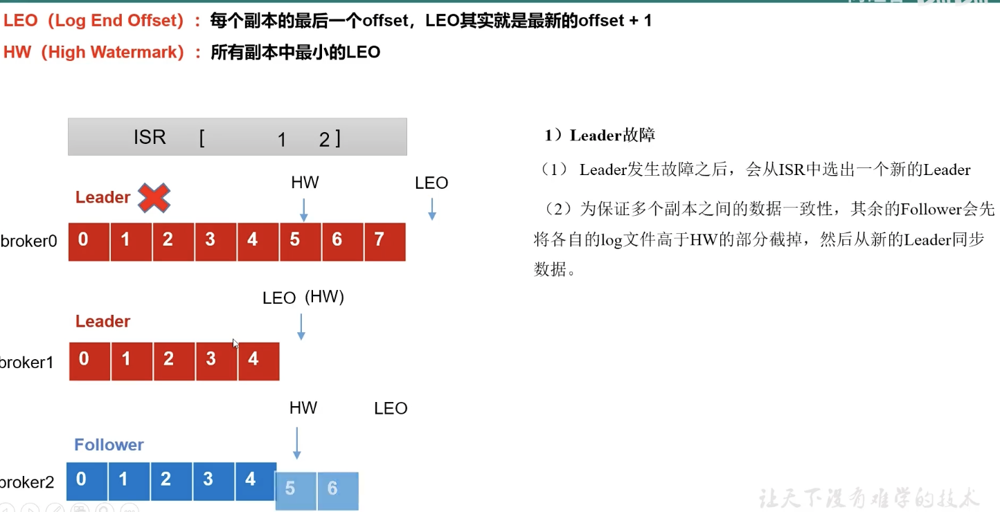

# www

Properties和Map都是以键值对的形式存储的，但是他们有什么区别吗？？
最大的区别就是 Properties可以直接导入IO流 读取IO流中的数据 并且能把自己的元素输出到IO流中。就是我们可以去写properties文件，进行读写。

## Kafka

kafka [] 命令后对topic增删改查 --config 引用配置文件

--list --create --describe 详情

分区内类似Hadoop，分块分割存储。分区从0开始，Leader为2  r
Replicas副本2 0 1。设计3个副本，分布于三台主机，

生产者消费者对Leader进行读写操作

分区数只能增加不能减少。不能通过命令行对方式增减副本。

开启消费服务之后，会增量的消费数据，加上from beginning 消费历史数据

Produce->Interceptors拦截器->Serializer序列化器->Pationer分区器，决定发送到哪个分区 以上过程在内存中完成默认32M。

只有数据累积到batch.size之后，sender才会发送数据，默认16k

linger.ms 数据如果迟迟未达到batch.size，sender等待linger.ms设置的时间

Request队列，由Kafka集群拉取到指定topic到指定分区，

拉取到时候，参考tcp的发送接收的缓冲区机制，允许5个或者若干个接收缓存，可以乱序，但接收缓存区必须接收完再进行下一批，否则重试等应答，发送的过程中进行集群的同步，消费一批，生产者删除一批。

Selector就是异步IO的方式，

同步、异步（情况较多）发送API，

回调函数，发送到队列，再返回发送结果。异步方法之后加上一个get()就行

表名字作为key，发到同一个表里面。

黏性分区，同一批数据尽量分在同一个分区，

### ISR

 Leader收到数据，所有Follower都开始同步数据，但有一个Follower，因为某种故障，迟迟不能与Leader进行同步，那这个问题怎么解决呢

 Leader维护了一个动态的in-sync replica set(ISR),意为和Lead保持同步的Follower+Leader集合（leader： 0， isr： 0，1，2

 如果Follower长时间未向Leader发送通信请求或同步数据，则该Follower将被**踢出ISR**，该时间阈值由
 replica.lag.time.max.ms参数设定，默认30s。例如2超时，(leader:0, isr 0,1
)

这样就不用等长期联系不上或者已经故障等节点，以后就不接收他的消息了

数据完全可靠条件=ACK级别设置为-1 + 分区副本大于等于2 + ISR里应答的最小副本数量大于等于2

ACK=0，生产者发送过来的数据就不管了，可靠性差，效率高

ACK=1，生产者发送过来数据 Leader应答，可靠性中等，效率中等。

ACK=-1 可靠性最高，生产者发送过来数据Leader和ISR队列里面所有Follower应答，可靠性高，效率低

生产环境中，acks=0很少使用，acks=1，一般用于传输普通日志，允许丢个别数据

acks=-1，一般用于传输比较要紧的数据，不允许出错。

至少一次，ACK级别为-1 + 分区副本大于等于2 + ISR里应答的最小副本数量大于等于2

最多一次，ACK级别设置为0
z
总结：

    ACK=-1可以保证数据不丢失，但不能保证数据不重复

    ACK=0可以保证数据不重复，但是不能保证数据不丢失

生产环境中需要精确一次，对于一些重要的信息，

幂等性，就是指Producer不论向Broker发送多少次重复数据，Broker端都只会持久化一次，保证了不重复

精确一次=幂等性 + ACK = -1

重复数据的判断标准，具有<PID,Partition,SeqNumber>相同主键的消息提交时，Broker只会持久化一次。其中PID时Kafka每次重启都会分配一个新的：partition表示分区号

Sequence Number是单调递增的

所以幂等性只能保证的是在单分区单会话内不重复

### 事务

事务协调器，默认有50个分区，每个分区负责一部分事务，事务分区是根据事务Id的hashcode值%50,

计算该事务处于哪个分区，该分区Leader副本所在的broken节点即为这个事务id对应的事务控制器节点

一个broken缓存接收五个request，如果五个request都符合要求（序号正确）则可以落盘，否则要重试

### zookeeper

可以查看broker信息，每台broker启动后，都会在zookeeper中注册

ids brokerid列表

主节点选举规则，以isr中存活为前提，按照AR中排在前面的优先，ar[1,0,2], isr[1,0,2], 那么leader就会按照1，0，2的顺序轮询

创建一个负载均衡的topic

vim topics-to-move.json

{
    "topics": [
        {"topic": "first"}, {"topic": "second"}
    ]
}

节点退役，生成一个退役计划，写入increase- replication-factor.json

### 架构

1. 生产者

   100T数据
2. broker

   1. broker 服务器 Hadoop102 103 104
   2. topic 主题 对数据的分类
   3. 分区
   4. 可靠性   副本
   5. leader follower
   6. 生产者和消费者 只针对leader操作
3. 消费者

   1. 消费者和消费者相互独立
   2. 消费者组（某个分区，只能由一个消费者消费）
4. zookeeper

   1. broker.ids 0 1 2
   2. leader

## 入门

1. 安装

   1. broker.id 必须全局唯一
   2. broker.id log.dirs zk.kafka
   3. 启动停止 先停止Kafka，再停zookeeper
   4. 脚本
      #!/bin/bash
2. 常用命令行

   1. 主题Kafka0 topic.sh
   2. 生产者 Kafka-console-producer.sh
   3. 消费者 kafka-console-consumer.sh

3.过程
    1. Kafka Producer
    2.  send
    3.  拦截器
    4.  序列化thrim
    5.  分区器，32M发送缓存，sender线程发送，
        1. 批次到或者时间到就可以发送
        2. NIO selector 打通，网络IO到指定集群的broker，分区副本之间同步

3. 生产者

   1. 原理
   2. 异步发送API
      1. 配置
         1. 连接 bootstrap- server
         2. key value序列化
      2. 创建生产者 KafkaProducer<String, String>()
      3. 发送数据 send() send( , new Callback)
      4. 关闭资源
   3. 同步发送 send() send( ,new Callback).get()
   4. 分区
      1. 分区的好处
         1. 存储
         2. 计算
      2. 默认分区规则
         1. 指定分区，按分区走
         2. key key的hashcode值%分区数
         3. 没有指定key 没有指定分区 黏性
      3. 自定义分区 定义类 实现partition接口
   5. 吞吐量提高
      1. 批次大小 16k 32k
      2. linger.ms 0=》5-100ms
      3. 压缩
      4. 缓存区大小 32m =》 64m
   6. 可靠性
      1. acks=0 会丢失数据 效率最高
      2. acks=1 也可能会丢，leader有应答机制 传输普通日志
      3. acks=-1 完全可靠 + 副本数量大于等于2 + isr大于等于2 =》不会丢失，会有数据重复
   7. 数据重复问题
      1. 幂等性
         1. <pid, 分区号， 序列号> 保证单机单连接 序列号单调递增
         2. 事务
            1. 底层基于幂等性
            2. 事务协调性 默认用50个分区，分布在各个节点？
            3. 事务id，对50取模，找到分区，所在的broker，的事务协调器，就是本次事务的负责人
            4. 生产者会跟事务协调器申请一个pid，给到之后向leader发送数据
            5. 发送数据之后，发送commit申请，然后根据持久化的结果返回给生产者，生产者再删除数据
            6. 五个API
               1. 初始化
               2. 启动
               3. 消费者offset
               4. 提交
               5. 终止
   8. 数据有序
      1. 单分区内有序
      2. 多分区有序
   9. 乱序
      1. inflight 设置为1
      2. 没有幂等性
      3. 有幂等性 对数个请求进行缓存，
4. broker

   1. zookeeper存储了哪些信息

      1. broker.ids
      2. leader
      3. 辅助选举 controller
   2. 工作流程

      1. 每个节点都有controller，参与主节点的竞争
      2. 选择AR节点内的，并且活着的排在前面的作为leader
      3. 生产者发送数据给集群的主节点进行读写，leader收到数据之后，follower会主动跟他同步，拉取数据，持久到磁盘。位置在logdir,topic不同的分区的log目录，
      4. log存储消息文件、index、timeIndex。分区也会创建索引，方便查询
      5. 消息索引

      bin/kafka-run-class.sh kafka.tools.DumpLogSegments --files 00000000000000000000.index

      最后一行
      offset:5083  position:1072592768

      6. Kafka如何查找指定offset的Message的
         1. 二分查找索引
   3. 服役和退役

      1. 准备一台新服务器 Hadoop
      2. 对哪个topic主题操作
      3. 形成计划
      4. 执行计划
      5. 验证计划
   4. 退役

      1. 要退役的节点不让存储数据
      2. 退出节点
5. Kafka副本

   1. 默认副本1个，生产环境一般默认两个，保证数据可靠性。太多副本增加磁盘存储空间，增加网络上数据传输，降低效率
   2. Kafka中副本分为：Leader和Follower。Kafka生产者只会把数据发往leader，然后Follower找leader进行同步数据
   3. Kafka分区中的所有副本统称为AR（Assigned Replicas） AR=ISR+OSR
      1. ISR： 表示和Leader保持同步的Follower集合（即经常保持活跃的可靠的Follower）。如果Follower长时间未向Leader发送通信请求或同步数据，则该Follower将被踢出ISR。该时间阈值由replica.lag.time.max.ms参数设定，默认30s，Leader发生故障后，就会从ISR选举新的leader。
      2. 
6. leader选举流程

   1. 在isr中存活为前提，按照AR中排在前面的优先
7. Follower故障处理细节

   1. LEO（long End Offset）每个副本的最后一个offset，LEO其实就是最新的offset+1
   2. HW （High Watermark） 所有副本中最小的 LEO
      
   3. Follower故障之后，会被临时踢出ISR。这个期间Leader和Follower继续接收数据
   4. 待该Follower恢复后，Follower会读取本地磁盘记录的上次的HW，并将log文件高于HW的部分截取掉，从HW开始向Leader进行同步
      
   5. 等待Follower的LEO大于等于该 partition的HW，即Follower追上Leader之后，就可以重新加入ISR了。
8. Leader故障处理细节

   1. Leader发生故障之后，会从ISR中选出一个新的Leader
      
   2. 为保证多个副本之间的数据一致性，其余的follower会先将各自的log文件高于HW的部分截掉，然后从新的Leader同步数据
   3. 注意，只能保证副本之间的数据一致性，不能保证数据不丢失或者不重复
      
   4. 新建一个topic，16个分区，3个副本，1主2从
